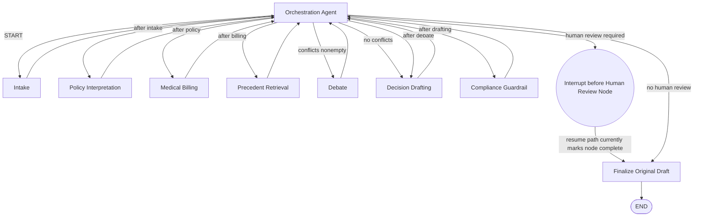
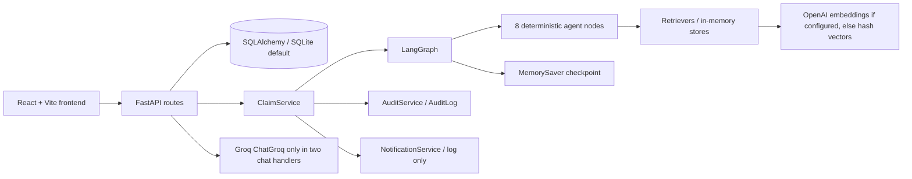

# InsureTrust Project Memory

Audit basis: executable code is authoritative. The initial inventory found 165 non-generated files; the three deliverables here were added after that inventory and are excluded from those counts. The tree below includes the current deliverables. Metrics exclude `.git/`, `Backend/.venv/`, `Frontend/node_modules/`, generated build output, and Python caches. The local `Backend/.env` exists; only key names were inspected, not values. This document does not copy local secrets. Source files were not modified.

## 1. Overview

InsureTrust is a demo insurance-claim intake and adjudication application. The React client calls a FastAPI backend. Claim submissions are persisted with SQLAlchemy and passed through a LangGraph state machine of eight Python worker agents; workers use deterministic rules and retrieval helpers, not agent LLM calls. A `MemorySaver` retains graph checkpoints only in process memory. SQLite is the default DB. Groq is optionally used by two claimant chat routes; OpenAI embeddings are optional, with a deterministic hash-vector fallback. Key implementation anchors: [Backend/api/main.py](Backend/api/main.py#L1), [Backend/services/claim_service.py](Backend/services/claim_service.py#L19), [Backend/graph/main_graph.py](Backend/graph/main_graph.py#L44), [Backend/graph/checkpoints.py](Backend/graph/checkpoints.py#L1).

Declared versions and constraints:

- Backend project `backend` version `0.1.0`; `requires-python = ">=3.13"`; `pyproject.toml` has an empty dependency array. See [Backend/pyproject.toml](Backend/pyproject.toml).
- Backend requirements declare minimums: FastAPI `>=0.109.0`, Uvicorn `>=0.27.0`, Pydantic `>=2.6.0`, pydantic-settings `>=2.1.0`, LangChain `>=0.1.0`, langchain-community `>=0.0.20`, langchain-core `>=0.1.20`, LangGraph `>=0.0.26`, PyYAML `>=6.0.1`, SQLAlchemy `>=2.0.25`, python-jose `[cryptography] >=3.3.0`, passlib `[bcrypt] >=1.7.4`, python-multipart `>=0.0.6`, python-dotenv `>=1.0.0`, faiss-cpu `>=1.7.4`, pytest `>=8.0.0`, email-validator `>=2.0.0`, and `langchain-groq` without a version. `langchain-groq` is present in the current worktree's pre-existing modified `Backend/requirements.txt`; do not assume this file is clean or revert it. See [Backend/requirements.txt](Backend/requirements.txt).
- Frontend is `insuretrust` version `0.0.0`, React and React DOM `^19.2.8`, React Router `^7.18.2`, Vite `^8.2.0`, Tailwind `^4.3.3`, lucide-react `^1.28.0`, Recharts `^3.10.1`; package scripts are `dev`, `build`, `lint`, and `preview`. See [Frontend/package.json](Frontend/package.json).
- `.python-version` is `3.13`; the backend README says Python `3.10+`, contradicting pyproject and `.python-version`. The observed interpreter during this audit was Python 3.14.3; Node was 24.8.0 and npm 11.6.0. See [Backend/.python-version](Backend/.python-version), [Backend/README.md](Backend/README.md#L107).

## 2. Directory Tree

The initial tree inventory contained 165 non-generated files, before these three documentation deliverables were created. The line-count analysis covers 163 UTF-8 text files from that initial inventory; it excludes local `.env` values and binary `hero.png`. Dependency/build payloads listed above are excluded.

```text
InsureTrust/
|-- .gitignore                         Python, local env, db, cache, and build exclusions
|-- PROJECT_MEMORY.md                  Durable repository context (this file)
|-- PROJECT_ANALYTICS.md               Measured size, dependency, integration, and risk audit
|-- AGENTS.md                          Short auto-loaded coding-agent guide
|-- Backend/                           FastAPI, LangGraph, SQLAlchemy, and RAG implementation
|   |-- .env                           Local secrets/config; do not copy values into docs
|   |-- .env.example                   Example setting names and development defaults
|   |-- .python-version                Python version pin: 3.13
|   |-- config.py                      Pydantic Settings and YAML config loader
|   |-- main.py                        Unused hello-world entrypoint; actual server is api.main
|   |-- pyproject.toml                 Backend metadata; Python >=3.13; dependencies empty
|   |-- README.md                      Backend setup, architecture, agent template, API overview
|   |-- requirements.txt               Backend dependency minima (currently pre-modified)
|   |-- uv.lock                        Minimal untracked lockfile; does not lock backend deps
|   |-- agents/                        Eight worker/orchestration packages
|   |   |-- __init__.py                Package marker
|   |   |-- orchestration_agent/       Sole routing authority in executable flow
|   |   |   |-- __init__.py            Package marker
|   |   |   |-- agent.yaml             Unused LLM prompt/model/tool metadata
|   |   |   |-- graph.py               State reads, deterministic orchestration call, route adapter
|   |   |   |-- README.md              Agent explanation and illustrative route trace
|   |   |   |-- state.py               Unused Pydantic state slice
|   |   |   `-- tools.py               Four deterministic routing/assessment tools
|   |   |-- intake_agent/              Completeness and severity classification
|   |   |   |-- __init__.py            Package marker
|   |   |   |-- agent.yaml             Unused prompt/model/tool metadata
|   |   |   |-- graph.py               Intake node and state patch
|   |   |   |-- README.md              Intake description and illustrative behavior
|   |   |   |-- state.py               Unused Pydantic state slice
|   |   |   `-- tools.py               Required-field and severity calculations
|   |   |-- policy_interpretation_agent/ Policy-clause retrieval and exclusion checks
|   |   |   |-- __init__.py            Package marker
|   |   |   |-- agent.yaml             Unused prompt/model/tool metadata
|   |   |   |-- graph.py               Policy retrieval node
|   |   |   |-- README.md              Policy agent description
|   |   |   |-- state.py               Unused Pydantic state slice
|   |   |   `-- tools.py               RAG call and title-word exclusion rule
|   |   |-- medical_billing_agent/     CPT/ICD rule checks and fee estimates
|   |   |   |-- __init__.py            Package marker
|   |   |   |-- agent.yaml             Unused prompt/model/tool metadata
|   |   |   |-- graph.py               Medical/billing node
|   |   |   |-- README.md              Medical agent description
|   |   |   |-- state.py               Unused Pydantic state slice
|   |   |   `-- tools.py               Fixed fee table, compatibility, duplicate checks
|   |   |-- precedent_agent/           Historical example retrieval and rate calculation
|   |   |   |-- __init__.py            Package marker
|   |   |   |-- agent.yaml             Unused prompt/model/tool metadata
|   |   |   |-- graph.py               Precedent retrieval node
|   |   |   |-- README.md              Precedent agent description
|   |   |   |-- state.py               Unused Pydantic state slice
|   |   |   `-- tools.py               Retriever wrapper and outcome ratio
|   |   |-- debate_agent/              Deterministic pro/con reconciliation function
|   |   |   |-- __init__.py            Package marker
|   |   |   |-- agent.yaml             Unused LLM debate prompts/model metadata
|   |   |   |-- graph.py               Runs pro, con, reconcile functions sequentially
|   |   |   |-- README.md              Debate behavior and example trace
|   |   |   |-- state.py               Unused Pydantic state slice
|   |   |   `-- tools.py               Evidence-count scoring and transcript formatting
|   |   |-- decision_drafting_agent/   Rule-based decision and payout generation
|   |   |   |-- __init__.py            Package marker
|   |   |   |-- agent.yaml             Unused LLM prompt/model metadata
|   |   |   |-- graph.py               Decision type, payout, citation, rationale node
|   |   |   |-- README.md              Drafting agent description
|   |   |   |-- state.py               Unused Pydantic state slice
|   |   |   `-- tools.py               Citation strings and payout calculation
|   |   `-- compliance_guardrail_agent/ Threshold and rationale checks
|   |       |-- __init__.py            Package marker
|   |       |-- agent.yaml             Unused compliance prompt/model metadata
|   |       |-- graph.py               Compliance node and human-review state patch
|   |       |-- README.md              Compliance agent description
|   |       |-- state.py               Unused Pydantic state slice
|   |       `-- tools.py               Appeal-text test and human-review thresholds
|   |-- api/                           FastAPI application and route modules
|   |   |-- __init__.py                Package marker
|   |   |-- main.py                    App lifecycle, CORS, router registration, health route
|   |   `-- routes/                    Route implementations
|   |       |-- __init__.py            Package marker
|   |       |-- auth.py                Registration, customer/staff login, JWT creation
|   |       |-- claims.py               Submit/list/detail and per-claim chat
|   |       |-- documents.py            Upload metadata and completeness check
|   |       |-- explanation.py          Claim explanation and Q&A chat
|   |       |-- ops_cases.py            Queue, graph state, transcript, and audit reads
|   |       |-- ops_decisions.py        Human approval/override/send-back actions
|   |       `-- analytics.py            KPI and audit-log reads
|   |-- database/                      SQLAlchemy persistence and ORM definitions
|   |   |-- database.py                Engine/session, password seed context, demo data
|   |   `-- models.py                  Ten ORM tables and relationship declarations
|   |-- graph/                          Global workflow state, graph wiring, checkpoint
|   |   |-- __init__.py                Package marker
|   |   |-- shared_state.py            ClaimAdjudicationState TypedDict
|   |   |-- main_graph.py              Nodes, conditional route map, interrupts, compilation
|   |   `-- checkpoints.py             Process-local MemorySaver singleton
|   |-- prompts/shared/                Shared text constants; unused by runtime code
|   |   |-- __init__.py                Package marker
|   |   |-- disclaimers.py             Legal and claimant disclaimer strings
|   |   `-- insurance_terms.py         Static insurance glossary
|   |-- rag/                            In-memory stores and retrieval helpers
|   |   |-- __init__.py                Package marker
|   |   |-- README.md                  RAG description, some claims not wired in code
|   |   |-- reranker.py                Token-overlap reranking (not a cross-encoder)
|   |   |-- ingestion/                 Loaders and embedding wrapper
|   |   |   |-- __init__.py            Package marker
|   |   |   |-- embedder.py            Optional OpenAI embeddings, hash-vector fallback
|   |   |   |-- policy_doc_loader.py    Policy section splitting
|   |   |   `-- precedent_case_loader.py Precedent record formatting
|   |   |-- retrievers/                Policy and precedent retrieval adapters
|   |   |   |-- __init__.py            Package marker
|   |   |   |-- policy_retriever.py     Store search followed by token-overlap ranking
|   |   |   `-- precedent_retriever.py  Store search followed by token-overlap ranking
|   |   `-- vectorstore/               Per-instance Python-list stores with seeded samples
|   |       |-- __init__.py            Package marker
|   |       |-- policy_store.py         In-memory clauses and built-in defaults
|   |       `-- precedent_store.py      In-memory precedents and built-in defaults
|   |-- schemas/                        Pydantic request/response types
|   |   |-- __init__.py                Package marker
|   |   |-- auth.py                    Login/register/token/profile types
|   |   |-- claims.py                  Claim submit/list/detail response types
|   |   |-- documents.py               Upload/completeness response types
|   |   `-- ops.py                     Ops, human-action, explanation, and chat types
|   |-- services/                       Route-level business orchestration
|   |   |-- __init__.py                Package marker
|   |   |-- claim_service.py            Create/process/resume claims and ORM writes
|   |   |-- audit_service.py            PII-sanitized node-output audit writes
|   |   `-- notification_service.py     Log-only notification placeholders
|   `-- utils/                          Logging and audit-snapshot sanitizing
|       |-- __init__.py                Package marker
|       |-- logger.py                  Stdout logger from LOG_LEVEL
|       `-- pii_masking.py             Regex masking for selected PII patterns
`-- Frontend/                           Vite React application
    |-- .gitignore                      Frontend dependency/build/editor exclusions
    |-- eslint.config.js                ESLint config (includes React Fast Refresh rules)
    |-- index.html                      App shell and favicon/font setup
    |-- package.json                    Frontend scripts and declared packages
    |-- package-lock.json               npm dependency lockfile
    |-- README.md                       Generic React/Vite template text, not project guide
    |-- vite.config.js                  React and Tailwind Vite plugins; no API proxy
    |-- public/                         Static assets
    |   |-- favicon.svg                 Browser favicon, referenced from index.html
    |   `-- icons.svg                    SVG symbol sprite; no references found
    `-- src/                            Browser application
        |-- App.jsx                     Route table and role guards
        |-- App.css                     Empty, not imported
        |-- index.css                   Tailwind import, theme variables and transitions
        |-- main.jsx                    React root, router and AuthProvider
        |-- api/clientApi.js             Active `/api/v1` API functions
        |-- assets/                      Brand/illustration and starter assets
        |   |-- AiAvatar.jsx             Bot icon avatar
        |   |-- hero.png                 Unreferenced placeholder-style artwork
        |   |-- Logo.jsx                 Brand icon and wordmark
        |   |-- react.svg                Unreferenced starter asset
        |   |-- ShieldIllustration.jsx   Inline SVG illustration used by landing page
        |   `-- vite.svg                 Unreferenced starter asset
        |-- auth/                        Token context, route guards, and dead API modules
        |   |-- AuthContext.jsx          Login/logout context; decodes JWT in browser
        |   |-- RouteGuard.jsx            Client-side role-only navigation guard
        |   |-- clientApi.js              Unused legacy calls to missing `/api/client` routes
        |   `-- opsApi.js                  Unused legacy calls to missing `/api/ops` routes
        |-- layouts/                     Public, claimant, and operations shells
        |   |-- PublicLayout.jsx          Public navigation layout
        |   |-- ClientLayout.jsx           Customer sidebar/header and outlet
        |   `-- OpsLayout.jsx              Staff sidebar/header and outlet
        |-- pages/                       Route-level views
        |   |-- LandingPage.jsx            Public landing page
        |   |-- UserLoginPage.jsx          Customer login form
        |   |-- StaffLoginPage.jsx         Staff form; organization value is not sent to API
        |   |-- DashboardPage.jsx           Claims list/dashboard
        |   |-- AiAssistantPage.jsx         Claim selection and per-claim chat
        |   |-- OpsQueuePage.jsx             Queue, analytics and audit tabs
        |   `-- CaseWorkspacePage.jsx        Case detail plus mock panels/no-op actions
        `-- components/                  Reusable client, ops and shared controls
            |-- client/                   Claimant-side components
            |   |-- ActivityItem.jsx       Activity row; unused in pages
            |   |-- ClaimDrawer.jsx         Local fake intake; no submit/upload API
            |   |-- ClientSidebar.jsx       Customer links and logout
            |   |-- MobileHeader.jsx         Customer mobile header
            |   |-- MobileTabBar.jsx         Customer bottom navigation
            |   |-- PolicyCard.jsx           Policy presentation; unused in pages
            |   |-- RecommendationCard.jsx   Recommendation presentation
            |   `-- index.js                Barrel exports
            |-- ops/                      Operations-side components
            |   |-- AdjustersList.jsx        Hardcoded sample adjusters
            |   |-- ClaimsTable.jsx          Local queue filtering/table
            |   |-- DebatePanel.jsx           Hardcoded sample debate transcript
            |   |-- DecisionActionBar.jsx     Calls passed action callbacks
            |   |-- OpsSidebar.jsx            Queue nav/logout/collapse
            |   |-- ReasoningPanel.jsx         Hardcoded sample reasoning
            |   `-- index.js                 Barrel exports
            `-- shared/                    General UI controls
                |-- Avatar.jsx              Initial/avatar display
                |-- Button.jsx              Styled button wrapper
                |-- Card.jsx                Bordered surface wrapper
                |-- ChatComposer.jsx         Text chat input
                |-- DonutChart.jsx           Recharts donut, unused in pages
                |-- Drawer.jsx               Slide-in panel
                |-- IconButton.jsx           Icon button
                |-- KpiCard.jsx              KPI summary card
                |-- Modal.jsx                Modal, unused in pages
                |-- StatusChip.jsx           Status badge
                |-- Tabs.jsx                 Tab selector
                |-- Timeline.jsx             Timeline display
                `-- index.js                 Barrel exports
```

## 3. Architecture

### Single routing authority

`orchestration_node` calls `determine_next_agent`; `route_next_agent` returns its `next_agent`, and `graph/main_graph.py` maps that result to one registered graph node. All seven worker nodes have fixed edges back to `orchestration_agent`. See [orchestration graph](Backend/agents/orchestration_agent/graph.py#L9), [actual routing function](Backend/agents/orchestration_agent/tools.py#L46), and [master graph wiring](Backend/graph/main_graph.py#L49).

| `last_completed_agent` | Actual next node | Condition |
|---|---|---|
| empty or `START` | `intake_agent` | Initial route |
| `intake_agent` | `policy_interpretation` | Always |
| `policy_interpretation` | `medical_billing` | Always |
| `medical_billing` | `precedent_agent` | Always |
| `precedent_agent` | `debate_agent` | `conflicts` is nonempty |
| `precedent_agent` | `decision_drafting` | No conflicts |
| `debate_agent` | `decision_drafting` | Always |
| `decision_drafting` | `compliance_guardrail` | Always |
| `compliance_guardrail` | `human_review_interrupt` | `human_review_required` input to routing is true |
| `compliance_guardrail` | `finalize_decision` | Otherwise |
| `human_review_interrupt` | `finalize_decision` | If node executes |
| any other value | `finalize_decision` | Fallback |

Important control detail: complexity flags do not form separate simple/complex paths. `determine_next_agent` receives `is_complex` but does not branch on it. `orchestration_node` supplies `assess_escalation_need(...).escalation_required` to the `human_review_required` argument; that assessment is true for claimed amount >= $5,000, complexity >= 7, or an existing human-review flag. The actual route condition is otherwise the table above. See [routing tools](Backend/agents/orchestration_agent/tools.py#L7) and [orchestration node](Backend/agents/orchestration_agent/graph.py#L11).

### Nodes and edges

`graph/main_graph.py` registers ten nodes: `orchestration_agent`, `intake_agent`, `policy_interpretation`, `medical_billing`, `precedent_agent`, `debate_agent`, `decision_drafting`, `compliance_guardrail`, `human_review_interrupt`, and `finalize_decision`. Entry is `orchestration_agent`. Its conditional edge map names the seven workers and two terminal/system nodes. The seven workers each edge to orchestration. `human_review_interrupt` edges to `finalize_decision`; finalization edges to LangGraph `END`. Compilation uses shared `MemorySaver` with `interrupt_before=["human_review_interrupt"]`. There is no direct graph edge from a worker to another worker. See [main graph](Backend/graph/main_graph.py#L44) and [checkpoint setup](Backend/graph/checkpoints.py#L1).

`human_review_interrupt_node` implements action branches: `APPROVE` marks `human_overridden=False`; `OVERRIDE` marks it true but hardcodes `decision_type="APPROVE"`; all other actions return only paused status. The running service writes the payload with `as_node="human_review_interrupt"`, then streams from the checkpoint; actual execution skips that node and enters finalization. The observed resume test showed `APPROVE`, `OVERRIDE`, and `SEND_BACK` all resumed through `finalize_decision` only and retained graph decision `APPROVE`. See [node](Backend/graph/main_graph.py#L17), [resume code](Backend/services/claim_service.py#L112).



The pause/resume arrow describes the service's actual `as_node` behavior; the intended action node code is not run on the observed resume route.



Not every route uses `ClaimService`: several routes query/update ORM models directly. `MemorySaver` is volatile process memory, not durable DB checkpoint persistence.

## 4. Agents

For each agent, the directory has `agent.yaml`, `graph.py`, `README.md`, `state.py`, `tools.py`, and `__init__.py`. The node files and tools listed below are what execute; YAML prompts/model declarations and Pydantic agent-state classes are not read by the graph. No worker constructs or calls an LLM. The `@tool` functions are synchronous Python rules/wrappers called with `.invoke()`.

1. **Orchestration Agent** — files: `Backend/agents/orchestration_agent/{agent.yaml,graph.py,state.py,tools.py,README.md,__init__.py}`. Reads `claimed_amount`, `complexity_score`, `coverage_status`, `code_mismatches`, `exclusion_triggers`, `human_review_required`, `last_completed_agent`, and `workflow_path`; `claim_id` is read into an unused local. Writes `is_complex`, undeclared shared key `conflict_flags`, `escalation_required`, `escalation_reason`, `next_agent`, `workflow_reasoning`, `workflow_path`, `status`. Tools: `evaluate_claim_complexity`, `detect_conflict`, `assess_escalation_need`, `determine_next_agent` (4). Deterministic. Rules: amount >= $5,000 or severity >= 7 is complex/escalated; `coverage_status == EXCLUDED`, any mismatch, or any exclusion creates a conflict; fixed routing table above. `is_complex` is not used to select a route. YAML's $10,000 high-value and `unresolved_conflict_delta` 0.20 are unused. See [tools](Backend/agents/orchestration_agent/tools.py#L7).
2. **Intake Agent** — files: `Backend/agents/intake_agent/{agent.yaml,graph.py,state.py,tools.py,README.md,__init__.py}`. Reads claim input; completeness checks truthiness of `policy_number`, `claimed_amount`, and `incident_date`; reads diagnosis/procedure counts and amount. Writes `is_complete`, `missing_fields`, `complexity_score`, `is_complex`, `last_completed_agent`, `status`. Tools: `validate_claim_fields`, `calculate_severity_score` (2). Deterministic. Severity starts at 1; adds 4 for amount > $10,000, else 2 for > $3,000; adds up to 3 at 0.8 per diagnosis and up to 3 at 0.7 per procedure; caps at 10. Complex threshold >= 7 or amount >= $5,000. Empty diagnosis/procedure arrays are accepted; no claim incompleteness branch is routed. See [intake tools](Backend/agents/intake_agent/tools.py#L5).
3. **Policy Interpretation Agent** — files: `Backend/agents/policy_interpretation_agent/{agent.yaml,graph.py,state.py,tools.py,README.md,__init__.py}`. Reads description, diagnoses, product line; ignores policy number and procedure codes in retrieval. Writes `policy_clauses`, `coverage_status`, `exclusion_triggers`, `policy_interpretation_notes`, `last_completed_agent`, `status`. Tools: `retrieve_policy_clauses`, `check_exclusion_triggers` (2). Retrieval/ranking is deterministic or optional embedding API; no interpretation LLM. Exclusion rule is a case-insensitive title substring `pre-existing` or `exclusion`; diagnosis codes parameter is unused. Since retrieval asks for six then returns top three, defaults are initialized with three sample clauses; all three remain eligible. See [policy node](Backend/agents/policy_interpretation_agent/graph.py#L4) and [rules](Backend/agents/policy_interpretation_agent/tools.py#L11).
4. **Medical/Billing Agent** — files: `Backend/agents/medical_billing_agent/{agent.yaml,graph.py,state.py,tools.py,README.md,__init__.py}`. Reads diagnoses, procedures, amount. Writes `medical_findings`, `code_mismatches`, `unusual_charges`, `allowed_total`, `billing_status`, `last_completed_agent`, `status`. Tools: `validate_cpt_icd_compatibility`, `calculate_fee_schedule_allowed`, `detect_unbundling_or_duplicate` (3). Deterministic. Hardcodes an ECG 93000 mismatch for diagnosis S39.011A without R07.9; duplicate codes are flagged; known fee schedule 99214=$180, 93000=$75, 72148=$850, 97110=$65, unknown procedure=$150; with no procedures estimate allowed amount at 80% of claim. No external clinical/billing source is queried. See [billing rules](Backend/agents/medical_billing_agent/tools.py#L4).
5. **Precedent Agent** — files: `Backend/agents/precedent_agent/{agent.yaml,graph.py,state.py,tools.py,README.md,__init__.py}`. Reads description and diagnosis codes; sends first diagnosis and query to retriever. Writes `precedent_cases`, `historical_approval_rate`, `precedent_summary`, `last_completed_agent`, `status`. Tools: `retrieve_similar_precedents`, `calculate_historical_approval_rate` (2). No LLM; uses in-memory defaults and ranking. If no cases, approval rate is 0.50; outcomes containing `APPROV` count as approved. See [precedent rules](Backend/agents/precedent_agent/tools.py#L8).
6. **Debate Agent** — files: `Backend/agents/debate_agent/{agent.yaml,graph.py,state.py,tools.py,README.md,__init__.py}`. Reads policy clauses, precedents, approval rate, mismatches, exclusions, unusual charges. Writes pro/con arguments, conflict resolution, reconciliation recommendation, confidence delta, transcript, `last_completed_agent`, `status`. Tools: `evaluate_argument_strength`, `summarize_debate_transcript` (2). Deterministic three-function sequence, not an LLM debate. Score is capped at 0.95 from 0.40 + 0.15 per argument + 0.10 per evidence item. With mismatches, pro score greater than con score yields PARTIAL_APPROVE, otherwise DENY; without mismatches it unconditionally recommends APPROVE, even if exclusions exist. See [debate node](Backend/agents/debate_agent/graph.py#L4).
7. **Decision Drafting Agent** — files: `Backend/agents/decision_drafting_agent/{agent.yaml,graph.py,state.py,tools.py,README.md,__init__.py}`. Reads claim id, amount, allowed amount, reconciliation, coverage and mismatches. Writes draft, type, payout, rationale, citations, itemized payout, last agent, status. Tools: `format_legal_citations`, `compute_final_payout_schedule` (2). Deterministic. Existing reconciliation wins; otherwise DENY for `EXCLUDED` or >1 mismatch, PARTIAL_APPROVE if positive allowed < claimed, else APPROVE. DENY pays 0; APPROVE pays min(claimed, allowed) (or full claim when allowed <= 0); every other decision string pays `allowed_total`. It does not apply a deductible and rationale lacks the required appeal phrase for partial/denial. See [draft rules](Backend/agents/decision_drafting_agent/graph.py#L4) and [payout tool](Backend/agents/decision_drafting_agent/tools.py#L22).
8. **Compliance Guardrail Agent** — files: `Backend/agents/compliance_guardrail_agent/{agent.yaml,graph.py,state.py,tools.py,README.md,__init__.py}`. Reads claimed amount, complexity, draft/type/rationale. Writes compliance pass/flags, human-review flag/reason, final decision, last agent/status. Tools: `check_statutory_mandates`, `evaluate_human_review_threshold` (2). Deterministic. DENY/PARTIAL_APPROVE without case-insensitive phrase `right to request` adds a statutory flag. Human review at amount >= $5,000, complexity >= 7, or DENY. See [compliance tools](Backend/agents/compliance_guardrail_agent/tools.py#L7).

## 5. Shared State

`ClaimAdjudicationState` is a `TypedDict(total=False)`, so declared fields are optional at runtime. Field types and writers follow [shared_state.py](Backend/graph/shared_state.py#L3). Initial claim fields are assembled by `ClaimService` from the request. Agent fields are written by the named node; exact writes are in the agent summaries above.

| Field(s) | Type | Writer(s) / notes |
|---|---|---|
| `claim_id`, `policy_number`, `claimant_id`, `product_line`, `incident_date`, `claimed_amount`, `diagnosis_codes`, `procedure_codes`, `description` | `str`, `float`, `List[str]` per declarations | `ClaimService.submit_and_process_claim` initial state |
| `is_complete: bool`, `missing_fields: List[str]`, `complexity_score: float`, `is_complex: bool` | listed types | Intake; orchestration also recomputes `is_complex` |
| `policy_clauses: List[Dict[str, Any]]`, `coverage_status: str`, `exclusion_triggers: List[str]`, `policy_interpretation_notes: str` | listed types | Policy Interpretation |
| `medical_findings: List[Dict[str, Any]]`, `code_mismatches: List[str]`, `unusual_charges: List[str]`, `allowed_total: float`, `billing_status: str` | listed types | Medical/Billing |
| `precedent_cases: List[Dict[str, Any]]`, `historical_approval_rate: float`, `precedent_summary: str` | listed types | Precedent |
| `pro_arguments: List[str]`, `con_arguments: List[str]`, `conflict_resolution: str`, `reconciliation_recommendation: str`, `confidence_delta: float`, `debate_transcript: Optional[Dict[str, Any]]` | listed types | Debate |
| `draft_decision: Dict[str, Any]`, `decision_type: str`, `approved_amount: float`, `rationale: str`, `citations: List[str]`, `itemized_payout: Dict[str, Any]` | listed types | Decision Drafting |
| `compliance_passed: bool`, `compliance_flags: List[str]`, `human_review_required: bool`, `human_review_reason: Optional[str]`, `final_decision: Optional[Dict[str, Any]]` | listed types | Compliance; human-review node edits final decision if it runs; finalizer carries it forward |
| `last_completed_agent: str` | `str` | Every worker, human node, finalizer |
| `next_agent: str`, `workflow_path: List[str]`, `escalation_required: bool`, `escalation_reason: Optional[str]`, `workflow_reasoning: str` | listed types | Orchestration |
| `agent_outputs_so_far: List[Dict[str, Any]]` | listed type | No executable writer found |
| `status: str` | `str` | All worker/system nodes; overwritten at each step |
| `error: Optional[str]` | optional string | No executable writer found |
| `human_approval_action: Optional[str]`, `human_adjudicator_notes: Optional[str]` | optional strings | `ClaimService.resume_human_review` updates checkpoint |

`orchestration_node` additionally writes `conflict_flags`, which is absent from the declared shared TypedDict; `agent_outputs_so_far` is declared but never populated. The named agent-local Pydantic state classes are not used by graph compilation.

## 6. API Reference

All route handlers are unauthenticated: a JWT is created by login, but no route declares a JWT validation dependency or decodes/validates the bearer token. `Depends(get_db)` is a database-session dependency, not authentication. Prefix for routers is `/api/v1`; health is `/`. Methods and paths below are the actual decorators. DB touch describes direct ORM access plus service writes; graph means `claims_graph` checkpoint calls. Sources: [API app](Backend/api/main.py#L13), [routes](Backend/api/routes).

| Method and full path | Request -> response | Authentication | DB / graph / external |
|---|---|---|---|
| `GET /` | none -> health object | No | Settings only |
| `POST /api/v1/auth/register` | `UserRegisterRequest` (`email,password,full_name,role="claimant",organization_code?`) -> `UserProfileResponse` | No | reads Organization, writes User |
| `POST /api/v1/auth/login/customer` | `UserLoginRequest` (`email,password`) -> `TokenResponse` | No | reads User; creates signed JWT |
| `POST /api/v1/auth/login/staff` | `UserLoginRequest` -> `TokenResponse` | No | reads User; creates signed JWT |
| `POST /api/v1/claims/submit` | `ClaimSubmissionRequest` (`policy_number,claimant_id,incident_date,claimed_amount,diagnosis_codes?,procedure_codes?,description,documents_attached?`) -> `ClaimResponse` | No | writes Claim, AuditLog, optional Decision/DebateTranscript; graph; log-only notification |
| `GET /api/v1/claims?limit=50` | query integer `limit` -> `List[ClaimResponse]` | No | reads all Claims, no claimant filter |
| `POST /api/v1/claims/{claim_id}/chat` | JSON object with `message` -> `{reply}` | No | reads Claim, writes ChatMessage pair; Groq if available/configured, otherwise fixed fallback |
| `GET /api/v1/claims/{claim_id}` | path claim id -> `ClaimDetailResponse` | No | reads Claim and graph checkpoint |
| `POST /api/v1/documents/upload` | multipart form `claim_id`, `document_type`, `file` -> `DocumentUploadResponse` | No | reads Claim, writes Document metadata; does not store bytes |
| `POST /api/v1/documents/check-completeness?claim_id=...` | required query `claim_id` -> `CompletenessCheckResponse` | No | reads Claim and Documents |
| `GET /api/v1/explanation/{claim_id}` | path claim id -> `ExplanationResponse` | No | reads Claim and graph checkpoint |
| `POST /api/v1/explanation/chat` | `QAChatRequest` (`claim_id,user_question`) -> `QAChatResponse` | No | reads Claim, writes ChatMessage pair; Groq optional/fallback |
| `GET /api/v1/ops/cases/queue` | none -> `List[CaseQueueItemResponse]` | No | reads Claims and each graph checkpoint |
| `GET /api/v1/ops/cases/{claim_id}/graph-state` | path id -> state/metadata/next | No | graph checkpoint; injected DB session is unused |
| `GET /api/v1/ops/cases/{claim_id}/debate-transcript` | path id -> ORM transcript or graph transcript | No | reads DebateTranscript; graph fallback |
| `GET /api/v1/ops/cases/{claim_id}/audit-trail` | path id -> AuditLog list | No | reads AuditLog |
| `POST /api/v1/ops/decisions/{claim_id}/action` | `HumanReviewActionRequest` (`action,adjudicator_notes,modified_payout?,override_reason?`) -> message/id/status | No | graph resume and Claim update; `override_reason` unused |
| `POST /api/v1/ops/decisions/{claim_id}/approve?notes=...` | optional query `notes` -> message/id/status | No | graph resume and Claim update |
| `POST /api/v1/ops/decisions/{claim_id}/override?reason=...&modified_payout=...` | required query `reason`, optional query payout -> message/id/status | No | graph resume and Claim update |
| `GET /api/v1/analytics/kpis` | none -> KPI object | No | counts Claim and Decision; fixed processing-time value |
| `GET /api/v1/analytics/audit-logs` | none -> up to 25 compact audit entries | No | reads AuditLog |

Schema definitions: [auth](Backend/schemas/auth.py), [claims](Backend/schemas/claims.py), [documents](Backend/schemas/documents.py), [ops](Backend/schemas/ops.py). The route modules call Groq only in the two chat handlers; agent graph nodes do not call Groq or OpenAI chat models.

## 7. Database

SQLAlchemy models use string columns for statuses, not database enum types. `Base.metadata.create_all` runs on app startup, then `seed_demo_data()` seeds if there are no organizations. Default DB URL is SQLite at `Backend/claims_adjudication.db` (computed from config). Source: [models](Backend/database/models.py), [database setup and seed](Backend/database/database.py#L1).

| ORM model / table | Columns | Relationships |
|---|---|---|
| `Organization / organizations` | `id` String PK/index; `name` String; `code` unique/index String; `created_at` DateTime | `users` to User |
| `User / users` | `id` String PK/index; `email` unique/index; `hashed_password`; `full_name`; `role` String default `claimant`; `organization_id` nullable FK; `created_at` | `organization` to Organization |
| `Claim / claims` | `id` PK/index; `claim_number` unique/index; `claimant_id` FK User; `policy_number`; `status` default `SUBMITTED`; `complexity_score?`; `total_claimed_amount` default 0; `approved_amount` default 0; `created_at`; `updated_at` | documents, decisions, debate_transcripts, audit_logs, chat_messages (all cascade delete-orphan) |
| `Policy / policies` | `id` PK/index; unique/index `policy_number`; `product_line`; `effective_date`; `expiration_date`; JSON `coverage_details?`; `created_at` | none |
| `Document / documents` | `id` PK/index; `claim_id` FK; `document_name`; `document_type`; `storage_path`; `processed_status` default `PENDING`; `uploaded_at` | Claim |
| `Decision / decisions` | `id` PK/index; `claim_id` FK; `decision_type`; `rationale`; JSON `itemized_payout?`; `compliance_status` default `PASSED`; `approved_by?`; `human_overridden` default false; `override_reason?`; `created_at` | Claim |
| `DebateTranscript / debate_transcripts` | `id` PK/index; `claim_id` FK; JSON `pro_approval_arguments?`; JSON `pro_denial_arguments?`; `reconciliation_summary?`; `confidence_delta` default 0; `created_at` | Claim |
| `AuditLog / audit_logs` | `id` PK/index; `claim_id` FK; `agent_name`; `action`; JSON `state_snapshot?`; `timestamp` | Claim |
| `ChatMessage / chat_messages` | `id` PK/index; `claim_id` FK; `role`; `content`; `created_at` | Claim |
| `PrecedentRecord / precedent_records` | `id` PK/index; unique/index `precedent_code`; `diagnosis_code?` index; `procedure_code?` index; `decision_outcome`; `summary`; `vector_id?`; `created_at` | none |

Claim status strings: model comment lists `SUBMITTED, IN_REVIEW, DEBATING, PENDING_APPROVAL, APPROVED, DENIED, OVERRIDDEN`; code writes those plus `APPROVE`, `DENY`, and `PARTIAL_APPROVE` from `decision_type`. Resume writes `APPROVED` for action APPROVE and `OVERRIDDEN` for every other action, including SEND_BACK. Graph-only statuses include `INTAKE_CLASSIFIED`, `POLICY_INTERPRETED`, `MEDICAL_BILLED`, `PRECEDENT_RETRIEVED`, `DEBATE_RECONCILED`, `DECISION_DRAFTED`, `COMPLIANCE_PASSED`, `PAUSED_FOR_HUMAN_REVIEW`, `ORCHESTRATED_TO_*`, and `COMPLETED_APPROVE` / `COMPLETED_DENY` / `COMPLETED_PARTIAL_APPROVE`. Initial DB Claim is `IN_REVIEW`; if human review is needed, submission persists `PENDING_APPROVAL`, otherwise it persists raw decision type. Analytics looks for `APPROVED`/`COMPLETED_APPROVE`, `DENIED`/`COMPLETED_DENY`, and a pending list; it omits raw `APPROVE`, `DENY`, `PARTIAL_APPROVE`, and `COMPLETED_PARTIAL_APPROVE`. Queue queries only `PENDING_APPROVAL`, `PAUSED_FOR_HUMAN_REVIEW`, `IN_REVIEW`, `DEBATING`. See [claim persistence](Backend/services/claim_service.py#L67), [analytics filters](Backend/api/routes/analytics.py#L11), [queue filter](Backend/api/routes/ops_cases.py#L15).

Other status-like strings: Document `PENDING` default and `PROCESSED` upload; Decision type comment `APPROVE`, `DENY`, `PARTIAL_APPROVE`; compliance status default `PASSED`; ChatMessage role comment `user/assistant/system`.

## 8. RAG Layer

- Loaders: `PolicyDocumentLoader.load_and_chunk_policy` splits on blank-line `SECTION ` separators; `PrecedentCaseLoader.load_precedent_records` builds case text/metadata. No runtime references to either loader exist.
- Embedder: `EmbeddingModelWrapper` uses `OpenAIEmbeddings` only when `settings.OPENAI_API_KEY` is nonempty and call succeeds. Otherwise `_pseudo_vector` repeats two-character slices of a SHA-256 hex digest into a vector; this is deterministic but not semantic. Runtime graph trace used empty OpenAI key and fallback vectors.
- Stores: `PolicyVectorStore` and `PrecedentVectorStore` use per-instance Python lists. Empty stores seed three hardcoded demo documents/cases. No FAISS calls or disk persistence; configured vector-store path settings are unused. Each retriever's global store instance persists only for that Python process.
- Retrieval: policy query includes description and diagnoses, filters by `product_line`, but not `policy_number`. Precedent retrieval adds 0.2 to exact diagnosis match. Policy interpretation asks for top 3. Default policy sample includes a title containing `Pre-Existing Condition Exclusion Clause`; the rule flags title words and ignores diagnosis context, so the simple HEALTH test input also triggered debate.
- Reranker: `CrossEncoderReranker` uses split-word overlap (`0.5 + 0.1 * overlap`), not a cross-encoder or semantic model.
- Actual wiring: only policy and precedent agents invoke retrievers. Loaders are unused. `faiss-cpu` is declared but not imported. `Policy`/`PrecedentRecord` ORM tables are not used as the live retrieval source. See [embedder](Backend/rag/ingestion/embedder.py), [stores](Backend/rag/vectorstore), [reranker](Backend/rag/reranker.py).

The RAG README describes a refresh process and calls the reranker a cross-encoder; the source confirms only a sample in-memory flow and token-overlap reranking. Code is authoritative. See [RAG README](Backend/rag/README.md) vs the implementation links above.

## 9. Frontend

### Route map and guards

`App.jsx` defines `/` public; `/login` and `/staff-login` public-only; `/dashboard` and `/assistant` require client-side `customer`; `/ops/queue` and `/ops/case/:id` require client-side `staff` or `admin`; wildcard redirects to `/`. These guards are UI-only and do not secure backend calls. [App route table](Frontend/src/App.jsx#L1), [guard](Frontend/src/auth/RouteGuard.jsx#L10).

| Page | Layout / guard | API behavior |
|---|---|---|
| LandingPage | PublicLayout, public | no API |
| UserLoginPage | PublicOnlyGuard | `AuthContext.login` -> customer login |
| StaffLoginPage | PublicOnlyGuard | staff login; entered org id is passed to context then dropped |
| DashboardPage | ClientLayout / customer | `getClaims(token,10)` -> `GET /claims` |
| AiAssistantPage | customer, own layout | `getClaims(token,5)`, `postClaimChat` -> `GET /claims`, `POST /claims/{id}/chat`; renders undefined `<Shield>` |
| OpsQueuePage | OpsLayout / staff/admin | `getOpsClaims`, `getOpsAnalytics`, `getAuditLogs` -> queue, KPI, audit endpoints |
| CaseWorkspacePage | OpsLayout / staff/admin | `getClaimById` -> claimant `GET /claims/{id}`; action callbacks use `alert()` and do not call decisions API; mock reasoning/debate panels |

### API functions and integration map

The active module is [Frontend/src/api/clientApi.js](Frontend/src/api/clientApi.js). It prefixes `/api/v1`, defaults to `http://127.0.0.1:8000/api/v1`, and attaches the browser token if supplied. `getClaims` sends `limit` in `X-Limit`; FastAPI declares a query parameter `limit`, so the backend ignores this header and uses default 50. `loginStaff(email,password)` accepts no org id. See [client API](Frontend/src/api/clientApi.js#L1).

| Frontend function | Backend route | Actual caller / mismatch |
|---|---|---|
| `loginCustomer` | POST `/auth/login/customer` | AuthContext; backend compares customer role |
| `loginStaff` | POST `/auth/login/staff` | AuthContext passes only email/password; StaffLogin org id is discarded |
| `getClaims` | GET `/claims?limit=...` | Dashboard and Assistant call it, but sends `X-Limit` header instead |
| `getClaimById` | GET `/claims/{id}` | CaseWorkspace calls this; no claimant filter or auth |
| `submitClaim` | POST `/claims/submit` | No shipped page calls it |
| `postClaimChat` | POST `/claims/{id}/chat` | Assistant calls it |
| `getClaimExplanation` | GET `/explanation/{id}` | No shipped page calls it |
| `postClaimExplanationQuestion` | POST `/explanation/chat` | No shipped page calls it |
| `getOpsClaims` | GET `/ops/cases/queue` | OpsQueue calls it |
| `getOpsClaimDetail` | GET `/ops/cases/{id}/graph-state` | No shipped page calls it |
| `getOpsAnalytics` | GET `/analytics/kpis` | OpsQueue calls it |
| `getAuditLogs` | GET `/analytics/audit-logs` | OpsQueue calls it |

Backend routes not called by live pages (12): register; claim submit; document upload and completeness; explanation get/chat; ops graph-state, debate transcript, audit trail; all three ops decision actions. The legacy [auth/clientApi.js](Frontend/src/auth/clientApi.js) and [auth/opsApi.js](Frontend/src/auth/opsApi.js) are not imported by pages and call nonexistent `/api/client/*` and `/api/ops/*` prefixes. These duplicate the active API surface by filename/domain but are dead in the current router integration.

Other frontend behavior/dead code:

- `ClaimDrawer` has no file input handler or API submission; form Submit only closes it. Chat mode fakes parsing with `setTimeout` and changes only claim type.
- Case workspace actions only call browser alerts; `claim.final_decision` object is interpolated as a string. `ReasoningPanel` and `DebatePanel` render hardcoded samples; not graph data.
- `AdjustersList` hardcodes staff. `ActivityItem`, `PolicyCard`, shared `DonutChart`, and `Modal` are barrel-exported but unused by pages. `App.css` is empty and unused. `hero.png`, `react.svg`, `vite.svg`, and `public/icons.svg` have no source references. `public/favicon.svg` is used by `index.html`.
- `AiAssistantPage.jsx` uses `<Shield>` without importing it. `npm run lint` reports `no-undef`; `npm run build` still succeeds because Vite does not catch the runtime name error.
- `AuthContext.jsx` exports both a component and non-component hook; lint reports `react-refresh/only-export-components`.
- `Frontend/README.md` is generic Vite template text, not actual app documentation.

## 10. Config and Environment

`Settings` defines: `PROJECT_NAME`, `ENV`, `LOG_LEVEL`, `SECRET_KEY`, `ALGORITHM`, `ACCESS_TOKEN_EXPIRE_MINUTES`, `DATABASE_URL`, `OPENAI_API_KEY`, `DEFAULT_LLM_MODEL`, `DEFAULT_EMBEDDING_MODEL`, `POLICY_VECTORSTORE_PATH`, `PRECEDENT_VECTORSTORE_PATH`, `AUTO_APPROVAL_MAX_AMOUNT`, and `HIGH_COMPLEXITY_SCORE_THRESHOLD`. Defaults include `SECRET_KEY="super-secret-key-change-this-in-production"`, SQLite DB under `Backend`, model `gpt-4o`, embedding `text-embedding-3-small`, auto-approval max $5,000, and complexity threshold 7. `SettingsConfigDict` loads `.env`, UTF-8, and ignores extra keys. See [config](Backend/config.py#L9) and [.env.example](Backend/.env.example).

`GROQ_API_KEY` is referenced by `claims.py` and `explanation.py` but is not declared in `Settings`. The local `.env` has a variable with that name, but `extra="ignore"` means `settings.GROQ_API_KEY` still raises `AttributeError`; the Groq builders catch only `RuntimeError`. Direct verification confirmed `hasattr(settings,"GROQ_API_KEY") == False`. The current requirements file includes `langchain-groq`, but this addition is an existing user change and should be preserved.

Defined-but-unused settings: `DEFAULT_LLM_MODEL`, `POLICY_VECTORSTORE_PATH`, `PRECEDENT_VECTORSTORE_PATH`; `get_agent_config()` is not called. Agent YAML `llm_model`, `temperature`, prompts, retries, and schemas are not consumed. Other runtime env names are listed in `.env.example`; local `.env` values are intentionally omitted here. `VITE_API_BASE_URL` is read in frontend API code but is not in an example env file. Vite config has no API proxy.

## 11. How to Run

Backend from `Backend/` (do not overwrite the already-present local `.env`):

```powershell
python -m venv .venv
.\.venv\Scripts\Activate.ps1
pip install -r requirements.txt
# Create .env from .env.example only if no local .env exists, then replace dev placeholders.
uvicorn api.main:app --reload --port 8000
```

The actual server entrypoint is `api.main:app`; root `Backend/main.py` only prints `Hello from backend!`. Startup initializes tables and demo rows. Frontend:

```powershell
cd Frontend
npm install
npm run dev
```

Vite defaults to port 5173. Set `VITE_API_BASE_URL` if the backend is not at `http://127.0.0.1:8000/api/v1`. Current CORS allows all origins/methods/headers with credentials.

Seeded demo identity values in [database.py](Backend/database/database.py#L33): customer `customer@insuretrust.com` / `customer123`; staff `staff@insuretrust.com` / `staff123`. They are seeded only when organizations table is empty. They currently do not authenticate: seed hashes use `pbkdf2_sha256`, while auth verifies using bcrypt only; a direct isolated check raised `UnknownHashError`.

## 12. Conventions

The documented agent template is five files: `agent.yaml`, `graph.py`, `state.py`, `tools.py`, `README.md`; current directories also include a sixth `__init__.py`. To add a worker, define its state slice and `@tool` functions, implement a node that returns only updated state and sets `last_completed_agent`, register it in `graph/main_graph.py` with an edge back to orchestration, then add its exact node name to `determine_next_agent` and the conditional-edge map. Validate the fixed route table. Do not assume YAML activates prompts or models: there is no YAML reader call in the current agent runtime. The Backend README says route changes belong only to the orchestrator; that is consistent with the current actual graph composition. See [Backend README](Backend/README.md#L128), [master graph](Backend/graph/main_graph.py#L49), [route tool](Backend/agents/orchestration_agent/tools.py#L46).

## 13. Known Issues

Severity reflects impact if this demo is used beyond isolated local testing. Detailed evidence/priority is also in `PROJECT_ANALYTICS.md`.

| Severity | Verified issue | Evidence / narrow fix |
|---|---|---|
| Critical | No route validates JWT or enforces role/claimant ownership; claim lists/details/chat, ops, documents and decisions are public by ID. | [api/routes](Backend/api/routes); add bearer validation and claimant/org authorization to every protected route |
| Critical | Registration accepts arbitrary `role`; staff login allows `staff`/`admin`; admin role can be self-selected. | [auth schema](Backend/schemas/auth.py), [auth route](Backend/api/routes/auth.py#L31); allow-list role assignment and require privileged provisioning |
| High | Default known JWT `SECRET_KEY` is in Settings and example env. | [config](Backend/config.py#L13); fail startup without production secret |
| High | Demo seed PBKDF2 vs bcrypt-only auth yields `UnknownHashError`, so seeded login fails. | [database.py](Backend/database/database.py#L17), [auth.py](Backend/api/routes/auth.py#L13); use one migration-compatible hash context |
| High | Groq handlers read undeclared `settings.GROQ_API_KEY`; local `.env` extra is ignored, so chat can raise uncaught `AttributeError`. | [config](Backend/config.py#L9), [claims.py](Backend/api/routes/claims.py#L18), [explanation.py](Backend/api/routes/explanation.py#L17); declare and validate the setting or remove usage |
| High | Human resume marks `human_review_interrupt` as completed via `as_node`, so the action node is skipped; approve/override/send-back all finalize the original draft. | [claim_service.py](Backend/services/claim_service.py#L127), [main_graph.py](Backend/graph/main_graph.py#L17); use supported interrupt resume semantics and test each action |
| High | Paused submission does not persist draft `approved_amount` or a Decision; resume does not write a Decision or derive normal payout unless modified payout provided. | [claim_service.py](Backend/services/claim_service.py#L67); persist a pending draft separately, then atomically persist final decision/payout |
| High | Claim is committed before graph runs; uncaught graph failure can leave a stuck `IN_REVIEW` claim and partial audit trail. | [claim_service.py](Backend/services/claim_service.py#L25); transaction/error state and retry policy |
| Medium | DB, graph, analytics, and queue statuses disagree; raw decision strings and partial completion are missed by analytics. | [claim_service.py](Backend/services/claim_service.py#L72), [analytics](Backend/api/routes/analytics.py#L12); use one persisted enum/transition map |
| Medium | `getClaims` sends `X-Limit`; FastAPI expects `?limit=`, so UI limits 5/10 are ignored. | [client API](Frontend/src/api/clientApi.js#L35), [claims route](Backend/api/routes/claims.py#L39); use URLSearchParams |
| Medium | Simple HEALTH claim triggers debate because seeded policy title contains an exclusion phrase; exclusion rule ignores diagnosis and drafting/debate can still approve. | [policy store](Backend/rag/vectorstore/policy_store.py), [policy tool](Backend/agents/policy_interpretation_agent/tools.py#L15), [debate](Backend/agents/debate_agent/graph.py#L39); scope evidence to policy and evaluate exclusion semantics |
| Medium | Stores are in-memory and use sample docs/hash pseudo-vectors; no ingestion or persistence is wired. | [vector stores](Backend/rag/vectorstore), [embedder](Backend/rag/ingestion/embedder.py); persist real records and use a semantic store or disclose fallback |
| Medium | Policy retrieval ignores the incoming `policy_number`; no live Policy table lookup. | [policy node](Backend/agents/policy_interpretation_agent/graph.py#L5), [retriever](Backend/rag/retrievers/policy_retriever.py); filter to the claimant's actual contract |
| Medium | Frontend claim intake and case decisions are local stubs; reasoning/debate are hardcoded and final decision object is stringified. | [ClaimDrawer](Frontend/src/components/client/ClaimDrawer.jsx), [CaseWorkspace](Frontend/src/pages/CaseWorkspacePage.jsx#L41), [mock panels](Frontend/src/components/ops); wire APIs and display structured fields |
| Medium | Assistant references missing `Shield` import; assistant view throws at render. | [AiAssistantPage](Frontend/src/pages/AiAssistantPage.jsx#L69); import the icon |
| Medium | CORS allows `*` origins while allowing credentials. | [api/main.py](Backend/api/main.py#L34); restrict origins to deployed frontend domains |
| Medium | Graph checkpoint is only `MemorySaver`; process restart loses paused claim graph state and resume then errors. | [checkpoints.py](Backend/graph/checkpoints.py#L1), [resume](Backend/services/claim_service.py#L116); use durable checkpointer |
| Low | Staff login org/workspace input is required by UI but ignored by `loginStaff` and backend schema. | [StaffLoginPage](Frontend/src/pages/StaffLoginPage.jsx#L29), [client API](Frontend/src/api/clientApi.js#L31); implement tenant selection or remove field |
| Low | `.python-version`/pyproject require 3.13+, README says 3.10+; pyproject dependencies empty. | [version files](Backend/.python-version), [pyproject](Backend/pyproject.toml), [README](Backend/README.md#L100); align setup docs and one dependency source |
| Low | Upload builds a path from client filename but never writes uploaded bytes; no size/type/filename validation. Current code creates no filesystem traversal by itself because path is not opened. | [documents.py](Backend/api/routes/documents.py#L12); store safely and validate before using the path |
| Low | YAML prompts/model configs, agent state classes, shared glossary/disclaimers, and several configured paths/model names are unused. | [config](Backend/config.py), [agents](Backend/agents), [prompts](Backend/prompts/shared); either wire them or remove claims that imply use |

## 14. Open Questions / UNVERIFIED

- External Groq/OpenAI key validity and production presence are not tested; secret values are intentionally not displayed. `GROQ_API_KEY` field absence is verified regardless of local `.env` value.
- `Context.md` and `Memory.md` appeared in the initial workspace listing, but were absent from the filesystem listing and could not be read during the audit; their contents and whether they remain intended project files are UNVERIFIED.
- Business rule correctness, statutory applicability, actual policy-specific coverage, fee schedule validity, and intended role/tenant model require product/legal owners; hardcoded demo rules are not evidence of regulatory correctness.
- The actual deployed DB, durable checkpoint service, deployment CORS domains, and email/SMS provider are UNVERIFIED; checked-in code defaults to SQLite, MemorySaver, wildcard CORS, and log-only notifications.
- No test files or test functions were found in the scanned repository. Test coverage is effectively absent; no coverage measurement exists.
